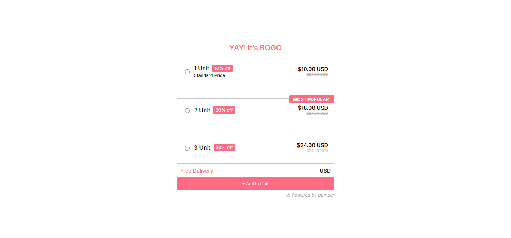
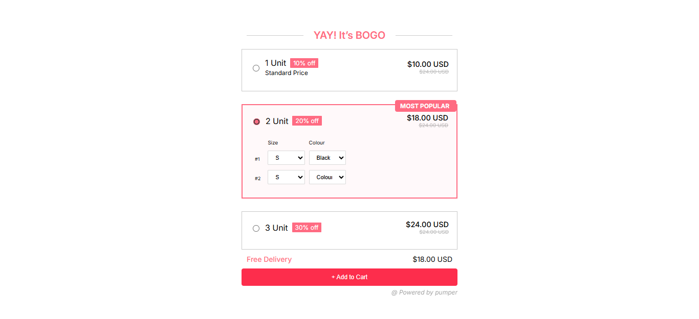

# Proveway Assessment – Technical Frontend Support
This is a submission for the **Technical Frontend Support** position at **Proveway Pvt Ltd**.  
The assessment was completed using **HTML, CSS, and JavaScript**.

## 📌 Objective

A simple web-based UI where selecting a **radio button** dynamically updates and displays its **related amount** in the **Total Amount section**.

## ⚙️ Features

- 🎯 Clickable **radio buttons**
- 💰 Dynamic **total amount display**
- 🎨 Clean and responsive UI
- 🧠 Uses **vanilla JavaScript DOM manipulation**## 🖼️ Screenshots

### 🔹 Main Page

### 🔹 After Selection

## 🚀 How to Run the Project

- Clone or download the repository
- Open index.html in any modern web browser.

  
## 🛠️ Technologies Used
- 🧱 HTML5
- 🎨 CSS3
- ⚙️ JavaScript
